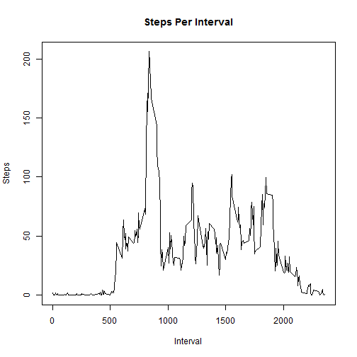
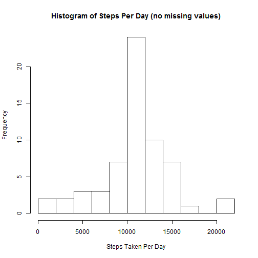
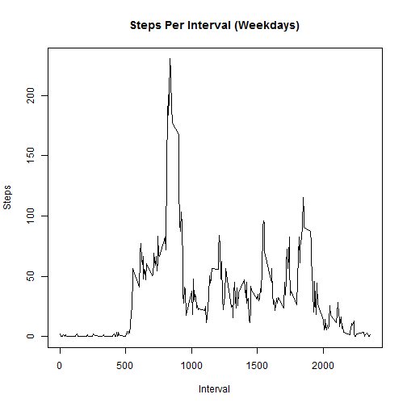
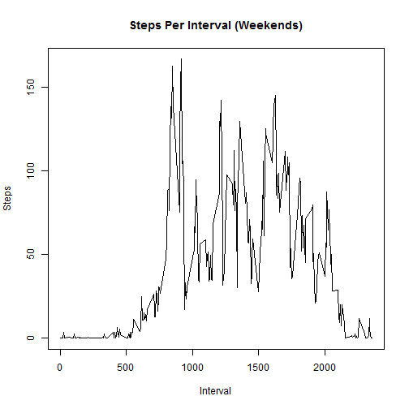

1. Loading and processing of the data into R:


```r
data <- read.csv("activity.csv")
```

2. What is mean total number of steps taken per day?

I calculated the steps taken each day and made a histogram:


```r
day <- tapply(data$steps,data$date,sum,na.rm=TRUE)
hist(day,breaks=10,xlab="Steps Taken Per Day",main="Histogram of Steps Per Day")
```

 

Then I calclated the mean and median of total steps each day:


```r
mean(day)
```

```
## [1] 9354.23
```

```r
median(day)
```

```
## [1] 10395
```

3. What is the average daily activity pattern?


```r
library(dplyr)
library(tidyr)
```

```r
#spread data with different dates in different columns
across <- spread(data,date,steps)
#calculating average steps across days
avg<-numeric()
for (i in 1:288){
      m<-mean(as.numeric(across[i,2:62]),na.rm=TRUE)
      avg<-c(avg,m)
}
#adding average steps data into the data frame
pattern <- mutate(across,avg=avg)
#plotting the pattern
plot(pattern$interval,pattern$avg,type="l",xlab="Interval",ylab="Steps",main="Steps Per Interval")
```

 

```r
max(avg)
```

```
## [1] 206.1698
```

```r
which.max(avg)
```

```
## [1] 104
```

So the largest number of steps within an interval is 206.17, the number 104 interval (interval 835-840) contaims the maximum number of steps.

4. Imputing missing values

The number of missing values:


```r
dim(data)[1]-sum(complete.cases(data))
```

```
## [1] 2304
```

There are 2304 observations with missing values. Then I replaced missing values with the mean of the 5-minute interval across 61 days.


```r
for (i in 1:288){
      pattern[i,][is.na(pattern[i,])]<-as.numeric(pattern[i,63])
}
```

Now missing values are filled in the data frame "pattern", according to which I calculated the total steps taken each day:


```r
data_new <- pattern[,-c(1,63)]
day_total <- summarise_each(data_new,funs(sum))
hist(as.numeric(day_total),breaks=10,xlab="Steps Taken Per Day",main="Histogram of Steps Per Day (no missing values)")
```

 

```r
mean(as.numeric(day_total))
```

```
## [1] 10766.19
```

```r
median(as.numeric(day_total))
```

```
## [1] 10766.19
```

We can see that both the new average and median steps each day are larger than the data with missing values.

5. Are there differences in activity patterns between weekdays and weekends?

I separated data on weekdays and weekends:


```r
wdays<-pattern[,c(1:6,9:13,16:20,23:27,30:34,37:41,44:48,51:55,58:62)]
wends<-pattern[,c(1,7,8,14,15,21,22,28,29,35,36,42,43,49,50,56,57)]
```

Then I calculated average steps across weekdays and across weekends:


```r
mean_weekday <- numeric()
mean_weekends <- numeric()
for (i in 1:288){
      m <- mean(as.numeric(wdays[i,2:46]))
      mean_weekday <- c(mean_weekday,m)
}
wdays<-mutate(wdays,avg=mean_weekday)
for (i in 1:288){
      m <- mean(as.numeric(wends[i,2:17]))
      mean_weekends <- c(mean_weekends,m)
}
wends<-mutate(wends,avg=mean_weekends)
```

I plotted the two data sets:


```r
plot(wdays$interval,wdays$avg,type="l",xlab="Interval",ylab="Steps",main="Steps Per Interval (Weekdays)")
```

 

```r
plot(wends$interval,wends$avg,type="l",xlab="Interval",ylab="Steps",main="Steps Per Interval (Weekends)")
```

 
